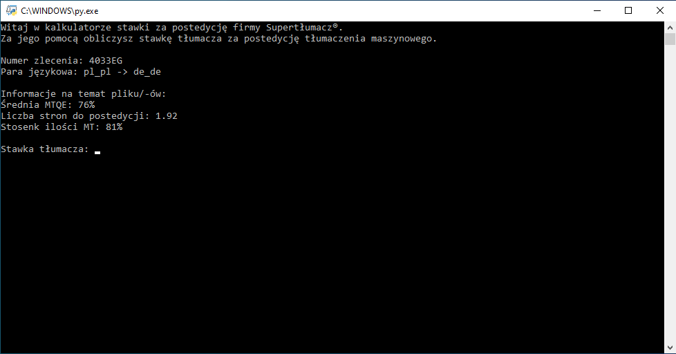

# postediting-rate-calculator
Machine translation postediting rate calculator using JSON data on average MTQE. The program uses JSON files from the Phrase TMS platform, containing the analysis of texts to be translated.

## Table of Contents
* [Tech Stack](#tech-stack)
* [Screenshots](#screenshots)
* [Run Locally](#run-locally)
* [Features](#features)
* [Room for Improvement](#room-for-improvement)
* [Project Status](#project-status)
* [Related](#related)
* [Used By](#used-by)
* [Authors](#authors)

## Tech Stack
- Python

## Screenshots


## Run Locally
Clone the project

```bash
  git clone https://github.com/bartlomiejlis/postediting-rate-calculator.git
```

Go to the project directory and run main.py with Python. You will need _Analysis #1.json_ in the same directory.

The program works in a text form. Follow instructions on your screen to start using it.

## Features
- Displaying project's name and language pair
- Calculation of the average MTQE from the formula
- Calculation of the number of billing pages for postediting
- Displaying the Machine Translation vs. Translation Memory content ratio
- Calculation of machine translation postediting rate from the formula

## Room for Improvement
- Adding possibility to read JSON files with different names. For now, as default, the program reads only JSON files named _Analysis #1.json_.

## Project Status
Project is: _no longer being worked on_.

## Related
Here are some related projects

- [TMs matches calculator](https://github.com/bartlomiejlis/tms-matches-calculator)
- [Phrase TMs export](https://github.com/bartlomiejlis/phrase-tms-export)

## Used By
This project is used by the following companies:
- [Supertłumacz](https://supertlumacz.pl/)

## Authors
Created by Bartłomiej Lis - feel free to contact me at lisu.b117@gmail.com!
